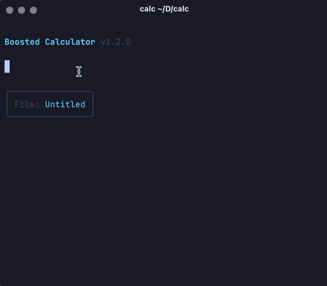

# Boosted Calculator

A powerful terminal-based calculator inspired by Numi, built with Bun, TypeScript, and Ink (React for CLI).



## Features

### ✅ Implemented
- **Basic arithmetic**: `+`, `-`, `*`, `/`, `^` (power), `%` (modulo)
- **Word operators**: `plus`, `minus`, `times`, `divided`, `mod`
- **Mathematical functions**: `sqrt`, `cbrt`, `abs`, `log`, `ln`, `fact`, `round`, `ceil`, `floor`
- **Trigonometry**: `sin`, `cos`, `tan`, `arcsin`, `arccos`, `arctan`
- **Hyperbolic**: `sinh`, `cosh`, `tanh`
- **Unit conversions**: Length, weight, temperature, time, volume, data
  - Examples: `100 cm in meters`, `32 F in C`, `1 hour in minutes`
- **Live currency conversion**: 300+ currencies updated daily from free API
- **Variables**: `x = 10`, then use `x` in expressions
- **Compound assignments**: `x += 5`, `text -= ".txt"`, `arr += [1,2,3]` - works for all types
- **Previous result**: Use `prev` to reference the previous line's result (skips empty lines and comments)
- **Aggregate operations**: `total` and `average` calculate sum/mean of previous numeric values (stops at empty line or comment)
  - String concatenation: `total` concatenates strings when previous results contain strings
- **Smart percentage calculations**: 
  - Basic: `20%` = 0.2
  - With operations: `100 - 10%` = 90, `100 + 10%` = 110
  - "Of" syntax: `20% of 100` = 20
  - Direct percentage math: `25% + 25%` = 0.5
- **String support** (v1.3.0):
  - String literals: backticks with interpolation (`hello ${name}`), single quotes ('text'), double quotes ("text")
  - String operations: concatenation (+), repetition (*), suffix removal (-)
  - Type casting: `as string`, `as number`
  - String functions: `len`, `substr`, `charat`, `trim`, `format`
  - Escape sequences: `\n`, `\t`, `\\`, `\``
- **Boolean operations** (v1.3.1):
  - Boolean literals: `true`, `false`, `null`
  - Comparison operators: `==`, `!=`, `<`, `>`, `<=`, `>=`
  - Logical operators: `and`, `or`, `not`
  - Ternary operator: `condition ? true : false`
  - Type casting: `as boolean`
- **Arrays and Objects** (v1.3.2):
  - Array literals: `[1, 2, 3]`, nested arrays, mixed types
  - Object literals: `{a: 1, b: 2}`, nested objects, string keys
  - Array functions: `push`, `pop`, `first`, `last`, `slice`, `length`, `sum`, `avg`/`average`
  - Object functions: `keys`, `values`, `has`
  - Property access: dot notation (`obj.property`), bracket notation (`arr[0]`)
  - Array operations: `[1,2] + [3,4]` → `[1,2,3,4]`, `[1,2,3] + 4` → `[1,2,3,4]`, `[1,2,3,2] - 2` → `[1,3]`
  - Type casting: `as array`, `as object` (parses JSON strings)
- **Syntax highlighting**: Numbers, operators, units, functions, variables, and strings are color-coded
- **History navigation**: Use up/down arrows to navigate through previous calculations
- **Multi-line support**: Press Enter to add new lines to expressions
- **Comments**: Use `#` for inline comments (e.g., `5 * 4 # multiply numbers`)
- **Formatting**: Invalid expressions are treated as comments (gray text), empty lines for organization
- **Clipboard copy**: 
  - `Ctrl+Y`: Copy the result value with visual feedback (yellow highlight)
- **Configurable precision**: Set decimal places for results via config.yaml
- **Date/time operations**: 
  - Keywords: `today`, `tomorrow`, `yesterday`, `now`, weekdays (`monday`, `tuesday`, etc.)
  - Date literals: `25.10.1988`, `25/07/2025` (DD.MM.YYYY or DD/MM/YYYY format)
  - Time literals: `12:00`, `10:30` (HH:MM format, uses system timezone)
  - Time with timezone: `12:00@moscow`, `10:30@utc-5`, `15:45@new york`
  - DateTime with timezone: `25.10.2025T12:15@moscow`
  - Timezone conversions: `12:00@moscow in utc`, `now in yerevan`
  - Arithmetic: `today + 5 days`, `now + 2 hours`, `tomorrow - 1 week`
  - Time arithmetic: `12:15@moscow - 10:00@moscow in minutes`
  - Date differences: `25/07/2025 - today in days`, `(01.01.2025 - 25.12.2024) in hours`
  - Supports: days, weeks, months, years, hours, minutes, seconds, milliseconds
- **Environment and arguments** (v1.3.6):
  - `env()` function: Read environment variables with `env("VAR_NAME")`
  - `arg()` function: Read input data (priority: stdin → --arg → null)
  - Type conversions: `env("PORT") as number`, `arg() as object`
  - CLI flags: `--arg "value"` for passing arguments
  - Output mode: `-o/--output` flag for pipeline-friendly file execution

## Requirements

- Node.js 18+ (runtime is fully Node.js compatible)
- Bun (for development only) - [Install Bun](https://bun.sh)

## Installation

### Install from npm (recommended)

```bash
npm install -g boosted-calc
# or
yarn global add boosted-calc
# or
bun add -g boosted-calc
```

### Build from source

```bash
# Clone the repository
git clone https://github.com/pyboosted/calc
cd calc

# Install dependencies
bun install

# Install globally
npm link
# or
npm install -g .
```

## Usage

```bash
# Run the calculator (interactive mode)
calc

# Open a file in interactive mode
calc budget.calc
calc calculations.txt

# Create a new file (will be created on save)
calc my-new-calculations.calc

# Non-interactive mode - calculate and print result
calc -e "2 + 2"
calc -e "today + 5 days"
calc -e "100 USD in EUR"
calc -e "sqrt(16) * 2"

# Using environment variables and arguments
calc -e "env(\"USER\")"
calc -e "arg()" --arg "Hello, World!"
echo "42" | calc -e "arg() * 2"
PORT=3000 calc -e "(env(\"PORT\") as number) + 1"

# Pipeline mode - execute file and output only last result
calc calculations.calc -o > result.txt
echo '{"items": [10, 20, 30]}' | calc sum-items.calc -o

# Update currency exchange rates
calc --update

# For development (from source)
bun start    # Run calculator
bun dev      # Run with file watching
```

## Supported Timezones

The calculator supports various timezone formats:
- UTC offsets: `utc`, `utc+3`, `utc-5`, etc.
- Common abbreviations: `est`, `pst`, `gmt`, `bst`, `cet`, etc.
- Major cities: `moscow`, `london`, `new york`, `tokyo`, `sydney`, `dubai`, etc.
- Multi-word cities: `new york`, `los angeles`, `hong kong`, `sao paulo`, etc.

## Configuration

The calculator stores its configuration in `~/.config/boomi/config.yaml`. The file is created automatically on first run with default values.

### Available Options

- **precision**: Number of decimal places for results (default: 2, range: 0-20)

Example config.yaml:
```yaml
# Boosted Calculator Configuration
# precision: Number of decimal places for results (default: 2)

precision: 4
```

## Keyboard Shortcuts

### Basic Controls
- **Ctrl+C / ESC**: Exit the calculator
- **Ctrl+L**: Clear all calculations
- **Ctrl+Y**: Copy result to clipboard
- **Enter**: Add a new line (for multi-line expressions)

### Navigation
- **Up/Down arrows**: Navigate through calculation history
- **Left/Right arrows**: Move cursor within input
- **Cmd+Left / Ctrl+A**: Move to beginning of line
- **Cmd+Right / Ctrl+E**: Move to end of line
- **Option+Left**: Move one word left
- **Option+Right**: Move one word right

### Editing
- **Backspace**: Delete character before cursor
- **Backspace at line start**: Merge with previous line
- **Cmd+Backspace / Ctrl+U**: Delete to beginning of line
- **Option+Backspace / Ctrl+W**: Delete word backwards
- **Ctrl+K**: Delete to end of line

## Examples

```
# Basic math
2 + 2
10 - 5
3 * 4
20 / 4
2 ^ 3
10 % 3

# Functions
sqrt(16)
sin(0)
round(3.14159, 2)

# Unit conversions
100 cm in meters
32 fahrenheit in celsius
1 gb in mb
20 ml in teaspoons

# Currency conversions (live rates)
100 USD in EUR
50 EUR in GBP
(100 USD + 50 EUR) in JPY

# Variables
x = 10
y = 20
x + y
sqrt(x^2 + y^2)

# Unicode variable names (including Cyrillic)
цена = 1500
скидка = 10%
цена - скидка

# Variables with date/time arithmetic
test = 2
test * 1 day + today
num = 5
tomorrow + num * 1 week

# Using previous result
10 + 5
prev * 2
prev - 5
# Comment line doesn't affect prev
prev / 3

# Inline comments
100 * 1.2 # add 20% markup
sqrt(144) # square root of 144
price = 50 # base price

# Aggregate operations
100
200
300
total          # 600
average        # 200

# With grouping
85
90
95
average        # 90

Comment or empty line breaks the group
50
total          # 50 (only counts this line)

# Percentages
20%
100 - 10%
100 + 10%
20% of 500
50% * 100
25% + 25%

# Date operations
today
tomorrow
today + 5 days
now + 2 hours
tomorrow - 1 week
monday + 3 days

# Date literals (DD.MM.YYYY or DD/MM/YYYY)
25.10.1988
01/01/2025
25/07/2025 - today in days
01.01.2025 + 30 days
birthday = 25.10.1988
today - birthday in days

# Time and timezone operations
12:00                          # Current timezone
10:30@utc                      # UTC time
12:00@moscow                   # Moscow time
15:45@new york                 # New York time
12:00@moscow in utc            # Convert to UTC
now in yerevan                 # Current time in Yerevan
12:15 - 10:00 in minutes       # Time difference
25.10.2025T12:15@moscow        # DateTime with timezone

# Comments and organization
Calculate monthly budget:

Income
1500 + 2000

Expenses
rent = 800
food = 300
utilities = 150
rent + food + utilities

Remaining
3500 - 1250

# String operations (v1.3.0)
# String literals
`Hello, World!`                        # Backticks with interpolation
'Single quotes'                        # No interpolation
"Double quotes"                        # No interpolation

# String interpolation
name = `John`
greeting = `Hello, ${name}!`
x = 10
message = `The value is ${x * 2}`

# String concatenation
`Hello` + ` ` + `World`
"Hello" + 123                          # "Hello123"
123 + " items"                         # "123 items"

# String repetition
`=` * 50                               # Creates a line of 50 equals signs
"abc" * 3                              # "abcabcabc"

# String subtraction (suffix removal)
`report_2025.txt` - `.txt`             # "report_2025"
"hello world" - " world"               # "hello"

# Type casting
num_str = 123 as string                # "123"
str_num = `456` as number              # 456
pi_str = 3.14159 as string             # "3.14159"

# String functions
len(`Hello`)                           # 5
substr(`Hello, World!`, 0, 5)          # "Hello"
substr(`Hello, World!`, 7)             # "World!"
charat(`Hello`, 1)                     # "e"
trim(`  spaces  `)                     # "spaces"

# Date formatting with strings
today_str = format(today, `dd/MM/yyyy`)
time_str = format(now, `HH:mm:ss`)
custom = format(today, `'Today is' EEEE`)

# Escape sequences
`Line 1\nLine 2`                       # Newline
`Column1\tColumn2`                     # Tab
`Path\\to\\file`                       # Backslashes
`She said \`hello\``                   # Backticks

# Boolean operations (v1.3.1)
# Boolean literals
true
false
null

# Comparison operators
5 == 5                                 # true
5 != 10                                # true
10 > 5                                 # true
5 < 10                                 # true
5 <= 5                                 # true
10 >= 10                               # true

# String comparisons
`abc` == `abc`                         # true
`abc` < `def`                          # true
`hello` != `world`                     # true

# Unit comparisons
100 cm == 1 m                          # true
1000 g < 2 kg                          # true
32 °F == 0 °C                          # true

# Logical operators
true and true                          # true
true and false                         # false
false or true                          # true
not true                               # false
5 > 3 and 10 < 20                      # true

# Short-circuit evaluation
false and x/0                          # false (doesn't evaluate x/0)
true or expensive_calculation          # true (doesn't evaluate calculation)

# Ternary operator
x = 10
x > 5 ? `big` : `small`                # "big"
is_member = true
price = is_member ? 90 : 100           # 90

# Type conversions
true as number                         # 1
false as number                        # 0
0 as boolean                           # false
1 as boolean                           # true
`` as boolean                          # false (empty string)
`hello` as boolean                     # true
null as boolean                        # false

# Truthiness in conditionals
count = 0
count ? `has items` : `empty`          # "empty"
name = `John`
name ? `Hello, ${name}` : `Guest`      # "Hello, John"

# Complex expressions
age = 25
is_adult = age >= 18
is_senior = age >= 65
discount = is_adult and not is_senior ? 10 : 0

# String aggregation
`Hello`
` `
`World`
total                                  # "Hello World"

# Arrays and Objects (v1.3.2)
# Array literals
[1, 2, 3]                              # Array of numbers
["a", "b", "c"]                        # Array of strings
[1, "hello", true]                     # Mixed types
[]                                     # Empty array
[[1, 2], [3, 4]]                       # Nested arrays

# Object literals
{x: 10, y: 20}                         # Object with properties
{"name": "John", "age": 30}            # String keys
{a: 1, b: "hello", c: true}            # Mixed value types
{}                                     # Empty object
{person: {name: "John", age: 30}}      # Nested objects

# Array functions
arr = [1, 2, 3]
push(arr, 4)                           # 4 (returns the pushed value, arr is now [1, 2, 3, 4])
pop(arr)                               # 4 (returns removed element, arr is now [1, 2, 3])
first(arr)                             # 1
last(arr)                              # 3
slice(arr, 1, 2)                       # [2]
length(arr)                            # 3
sum([1, 2, 3, 4])                      # 10
avg([10, 20, 30])                      # 20

# Object functions
obj = {a: 1, b: 2, c: 3}
keys(obj)                              # ["a", "b", "c"]
values(obj)                            # [1, 2, 3]
has(obj, "b")                          # true
has(obj, "x")                          # false

# Property access
arr = [10, 20, 30]
arr[0]                                 # 10 (bracket notation)
arr.1                                  # 20 (dot notation)
obj = {name: "John", age: 30}
obj.name                               # "John"
obj["age"]                             # 30

# Dynamic property access
key = "name"
obj[key]                               # "John"
index = 2
arr[index]                             # 30

# Nested access
data = {users: [{name: "John"}, {name: "Jane"}]}
data.users[0].name                     # "John"
data["users"][1]["name"]               # "Jane"

# Type casting with JSON
json_arr = `[1, 2, 3]`
parsed = json_arr as array             # [1, 2, 3]
json_obj = `{"x": 10, "y": 20}`
parsed_obj = json_obj as object        # {x: 10, y: 20}

# Arrays/objects to string
[1, 2, 3] as string                    # "[1,2,3]"
{a: 1, b: 2} as string                 # "{\"a\":1,\"b\":2}"

# sum and avg as functions vs aggregates
# As functions:
sum([1, 2, 3, 4])                      # 10
avg([10, 20, 30])                      # 20

# As aggregate keywords:
10
20
30
sum                                    # 60 (aggregate)
average                                # 20 (aggregate)

# Environment variables (v1.3.6)
# Read environment variables
env("HOME")                            # "/Users/username"
env("PATH")                            # System PATH
env("MISSING_VAR")                     # null

# Type conversion with env
port = env("PORT") as number           # Convert to number
port + 1000                            # 4000 (if PORT=3000)
debug = env("DEBUG") as boolean        # Convert to boolean

# Command-line arguments (v1.3.6)
# Read from stdin or --arg flag
arg()                                  # Reads stdin data or --arg value

# Type conversion with arg
data = arg() as object                 # Parse JSON object
items = arg() as array                 # Parse JSON array
value = arg() as number                # Convert to number

# Practical examples:
# 1. Process JSON data from stdin
# echo '{"price": 100, "tax": 0.08}' | calc -e "data = arg() as object" -e "data.price * (1 + data.tax)"

# 2. Use environment for configuration
# NODE_ENV=production calc -e "env(\"NODE_ENV\") == \"production\" ? \"prod\" : \"dev\""

# 3. Pipeline with output mode
# calc price-calc.calc -o | calc -e "arg() * 0.9"  # Apply 10% discount

# Compound assignment (v1.3.5)
x = 10
x += 5                                 # 15
x -= 3                                 # 12
x *= 2                                 # 24
x /= 4                                 # 6

# Works with all types
text = "file"
text += ".txt"                         # "file.txt"
arr = [1, 2]
arr += [3, 4]                          # [1, 2, 3, 4]
```

## Architecture

The calculator is built with a modular architecture:

- **Parser**: Tokenizer + AST parser for mathematical expressions
- **Evaluator**: Evaluates the AST with support for functions, units, and variables
- **Currency Manager**: Fetches and caches exchange rates from free API
- **UI Components**: React-based terminal UI using Ink
  - `Calculator`: Main component managing state
  - `Input`: Handles user input with syntax highlighting
  - `Display`: Shows results and errors
  - `HighlightedText`: Provides syntax highlighting

## Development

This project uses Bun as the package manager and development runtime, but is distributed as a standard Node.js package. The published npm package runs on Node.js without requiring Bun.

```bash
# Install dependencies
bun install

# Run tests
bun test

# Run tests in watch mode
bun test:watch

# Type checking
bun tsc --noEmit

# Build for distribution (creates dist/ folder)
bun run build

# Run development mode with hot reload
bun dev
```

### Publishing

The package is automatically built before publishing via the `prepublishOnly` hook. Just run:

```bash
npm publish
```

## License

MIT
