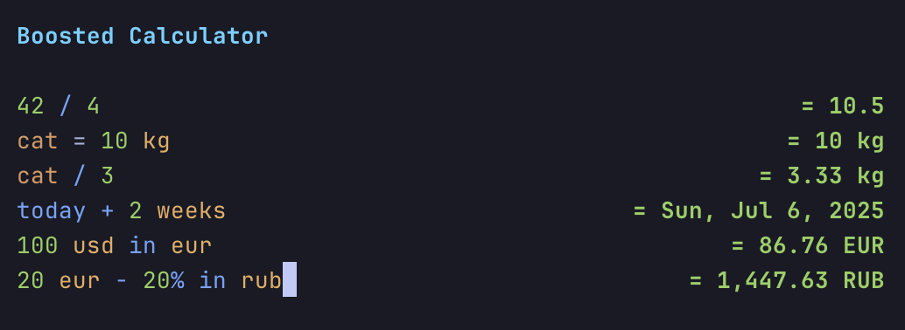

# Boosted Calculator

A powerful terminal-based calculator inspired by Numi, built with Bun, TypeScript, and Ink (React for CLI).



## Features

### ✅ Implemented
- **Basic arithmetic**: `+`, `-`, `*`, `/`, `^` (power), `%` (modulo)
- **Word operators**: `plus`, `minus`, `times`, `divided`, `mod`
- **Mathematical functions**: `sqrt`, `cbrt`, `abs`, `log`, `ln`, `fact`, `round`, `ceil`, `floor`
- **Trigonometry**: `sin`, `cos`, `tan`, `arcsin`, `arccos`, `arctan`
- **Hyperbolic**: `sinh`, `cosh`, `tanh`
- **Unit conversions**: Length, weight, temperature, time, volume, data
  - Examples: `100 cm in meters`, `32 F in C`, `1 hour in minutes`
- **Live currency conversion**: 300+ currencies updated daily from free API
- **Variables**: `x = 10`, then use `x` in expressions
- **Previous result**: Use `prev` to reference the last calculation
- **Smart percentage calculations**: 
  - Basic: `20%` = 0.2
  - With operations: `100 - 10%` = 90, `100 + 10%` = 110
  - "Of" syntax: `20% of 100` = 20
  - Direct percentage math: `25% + 25%` = 0.5
- **Syntax highlighting**: Numbers, operators, units, functions, and variables are color-coded
- **History navigation**: Use up/down arrows to navigate through previous calculations
- **Multi-line support**: Press Enter to add new lines to expressions
- **Comments and formatting**: Invalid expressions are treated as comments (gray text), empty lines for organization
- **Configurable precision**: Set decimal places for results via config.yaml
- **Date/time operations**: 
  - Keywords: `today`, `tomorrow`, `yesterday`, `now`, weekdays (`monday`, `tuesday`, etc.)
  - Arithmetic: `today + 5 days`, `now + 2 hours`, `tomorrow - 1 week`
  - Supports: days, weeks, months, years, hours, minutes, seconds

### 🚧 Todo
- Advanced percentage calculations (`20% of what is 30 cm`)
- Sum/Average operations on multiple values
- Better error handling and recovery
- Persistent history across sessions

## Installation

```bash
# Clone the repository
git clone <repository-url>
cd calc

# Install dependencies
bun install
```

## Usage

```bash
# Run the calculator
bun start

# Or run with file watching (development)
bun dev

# Update currency exchange rates
bun run update-currencies
# Or
./calc --update

# Install globally (optional)
bun link
calc
```

## Configuration

The calculator stores its configuration in `~/.config/boomi/config.yaml`. The file is created automatically on first run with default values.

### Available Options

- **precision**: Number of decimal places for results (default: 2, range: 0-20)

Example config.yaml:
```yaml
# Boosted Calculator Configuration
# precision: Number of decimal places for results (default: 2)

precision: 4
```

## Keyboard Shortcuts

- **Ctrl+C / ESC**: Exit the calculator
- **Ctrl+L**: Clear the current input
- **Enter**: Add a new line (for multi-line expressions)
- **Up/Down arrows**: Navigate through calculation history
- **Left/Right arrows**: Move cursor within input

## Examples

```
# Basic math
2 + 2
10 - 5
3 * 4
20 / 4
2 ^ 3
10 % 3

# Functions
sqrt(16)
sin(0)
round(3.14159, 2)

# Unit conversions
100 cm in meters
32 fahrenheit in celsius
1 gb in mb
20 ml in teaspoons

# Currency conversions (live rates)
100 USD in EUR
50 EUR in GBP
(100 USD + 50 EUR) in JPY

# Variables
x = 10
y = 20
x + y
sqrt(x^2 + y^2)

# Using previous result
10 + 5
prev * 2

# Percentages
20%
100 - 10%
100 + 10%
20% of 500
50% * 100
25% + 25%

# Date operations
today
tomorrow
today + 5 days
now + 2 hours
tomorrow - 1 week
monday + 3 days

# Comments and organization
Calculate monthly budget:

Income
1500 + 2000

Expenses
rent = 800
food = 300
utilities = 150
rent + food + utilities

Remaining
3500 - 1250
```

## Architecture

The calculator is built with a modular architecture:

- **Parser**: Tokenizer + AST parser for mathematical expressions
- **Evaluator**: Evaluates the AST with support for functions, units, and variables
- **Currency Manager**: Fetches and caches exchange rates from free API
- **UI Components**: React-based terminal UI using Ink
  - `Calculator`: Main component managing state
  - `Input`: Handles user input with syntax highlighting
  - `Display`: Shows results and errors
  - `HighlightedText`: Provides syntax highlighting

## Development

```bash
# Run tests
bun run test.ts

# Type checking
bun tsc --noEmit
```

## License

MIT
